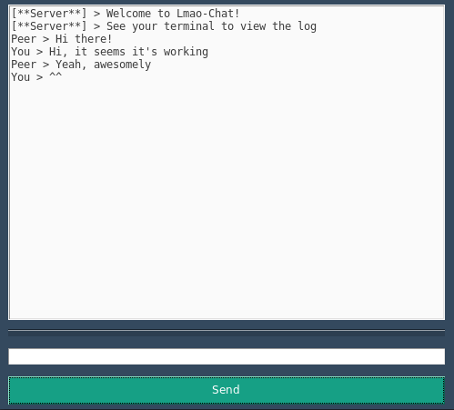

# P2P Encrypted Chat



This is a project for Network Fundamentls subject on the University of Granada. The goal is to analyce or develop a system which use encryption and multiple message exchange between client-server and/or client-client.

This project is divided in two repositories attending to its main functionality:

- **P2P Chat Client:** https://github.com/salvacorts/FR-Chat-Client
- **Tracker Server:** https://github.com/salvacorts/FR-Chat-RestTracker


## Installation and run:

```bash
pip install -r requirements.txt
./client.py
```


## How does it works:

On one side, we have a REST Server, written on pyhton with Hug, that works as a traker which let the user get the necessary information to connect with it's peer. There are three basic operations that can be performed with the tracker:

1. **Add user information:** It will add a user name to its DB alongside with it's IP address, it's Listening Port number and it's RSA public key.
2. **Get User information:** The client will get the IP address, the listening port number and the public RSA key for the peer identified by the name given. This information is returned as a JSON
3. **Update user information:** It will update the Listening port and the IP address. To be able to update this information, the user must send a validation message alongside the new information. This validation message is signed with the user's private rsa key and will be validated by the server with his last public key stored.

On the other side, we have the clients which besides interacting with the server, it also interact directly with other clients as a Peer to Peer chat service. It launch two threads:

The first one, will bind a socket to the local listening port and it will start listening for incoming connections.

The second one will also bind to the local listening port but it will try to connect to the peer.

Note that binding to the same address on two different processes is only possible from Linux kernels >= 3.9 (https://lwn.net/Articles/542629/).

Once a connection is stablished, these two threads will stop and messages will be sent through the socket which has stablished connection earlier.

This is a secure chat which uses asymetric encryption. All mesages sent will be encrypted with the receiver public RSA key, and every message received will be decrypted with the user private RSA key.

As this is a P2P application, Ports must be opened on user's routers. This application will try to open them with UPnP. If you dont have this feature activated, or it doesnt work, you will have to make a manual Port Forwarding.

Because the tracker server is not a dedicated server (it runs on heroku) we can't perform a NAT TCP Hole punching unless the router bind the same port as the local address outcoming port.


**About the implementation:**

Note that this project is a proof of concept for a subject, so it doesn't pretends to offer a final product. There are some things that could have been implemented easier, like the encryption when sending and receiving from sockets; a secure socket wrapper like the one below would be much easier. But the goal was to understant and implement how it works at low level.

```python
socket = socket.socket(socket.AF_INET, socket.SOCK_STREAM)
securedSocket = ssl.wrap_socket(socket, ssl_version=ssl.PROTOCOL_TLSv1,
                                ciphers="ADH-AES256-SHA")

securedSocket.connect((peerIP, peerPort))
securedSocket.send("Eii there".encode())

securedSocket.close()
```
